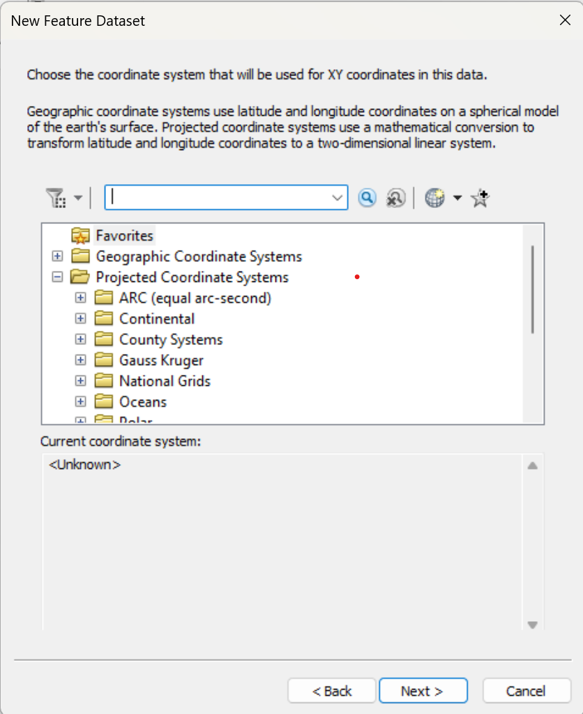

# Task 1: Workspace and Geodatabase Preparation

### Objective:
### The objective of this task is to prepare a proper GIS workspace by creating a file geodatabase with the correct naming convention. This geodatabase will be used to store and manage all spatial datasets required for the project.

---

### Step 1: Create a File Geodatabase

1. Open ArcCatalog (or the Catalog pane in ArcGIS Pro).
2. Connect to the folder where you want to store your project data.
3. Right-click inside the connected folder and select New → File Geodatabase.

     

---

### Step 2: Name the Geodatabase

After the file geodatabase is created, rename it using the required format:

        District_Municipality_CodeNumber

   

---

### Step 3: Create a Feature Dataset

To organize vector data and maintain spatial consistency, a Feature Dataset was created inside the file geodatabase.

1. Right-click the file geodatabase

        Kavrepalanchowk_Panchkhal_2278639.gdb

2. Select New → Feature Dataset.
3. Name the feature dataset using the district name:

        Kavrepalanchowk

   

   

---

### Step 4: Set Nepal’s Projected Coordinate System

1. In the Create Feature Dataset wizard, click Select Coordinate System.
   
   
   
2. Navigate to:
Projected Coordinate Systems → National Grids → Nepal
3.Select Nepal National Grid and proceed to finish the setup.

   

This ensures that all vector layers within the feature dataset share the same projected coordinate system, which is essential for accurate spatial analysis.

---

### Step 5: Vector Data Storage

All vector datasets (feature classes) related to the selected study area will be stored inside the Kavrepalanchowk feature dataset. This includes layers such as administrative boundaries, wards, roads, and other thematic layers.

At this stage, vector datasets are not yet available. The feature dataset has been prepared to store all vector layers in subsequent tasks while maintaining spatial consistency.

---

## Conclusion

In this task, a GIS workspace was prepared by creating a file geodatabase named Kavrepalanchowk_Panchkhal_2278639.gdb following the required naming convention. A feature dataset named Kavrepalanchowk was created using Nepal’s projected coordinate system to ensure spatial consistency. Although no spatial data were added at this stage, the geodatabase structure has been properly organized for use in subsequent GIS analysis tasks.
