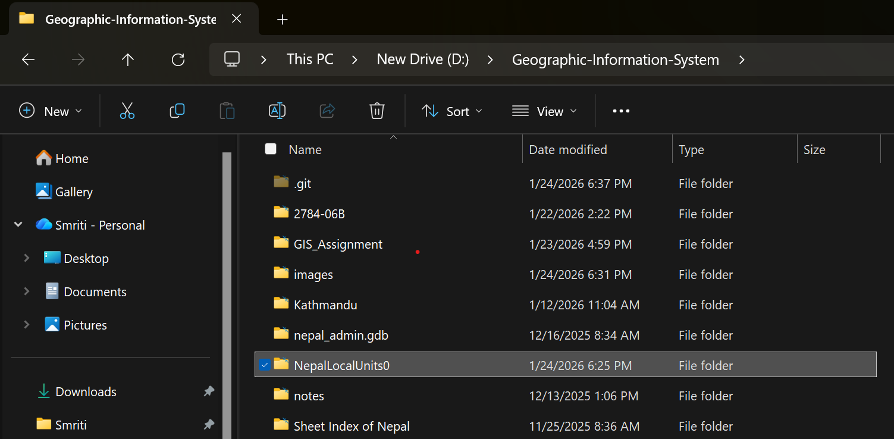
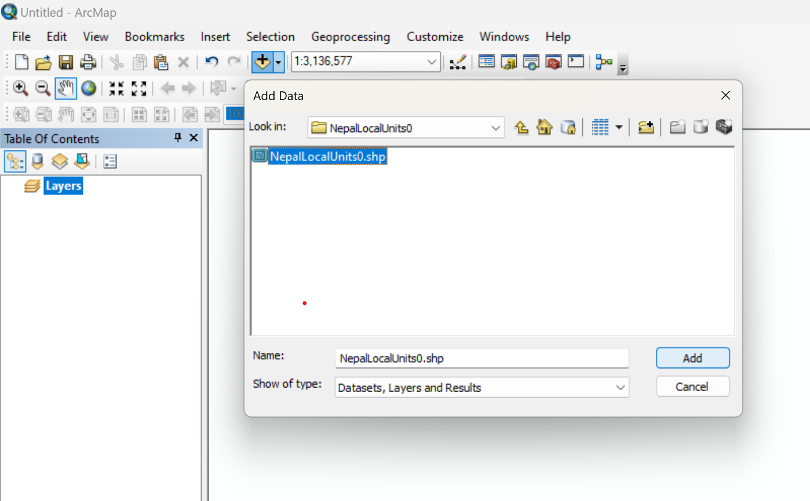
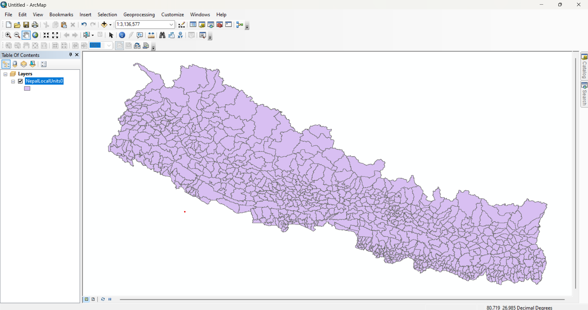
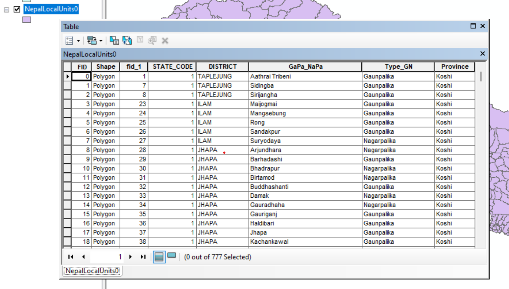
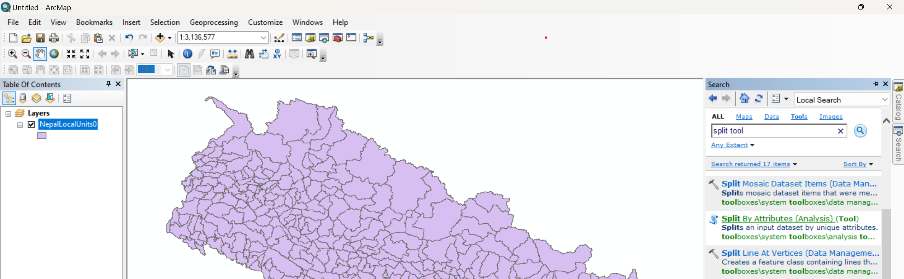
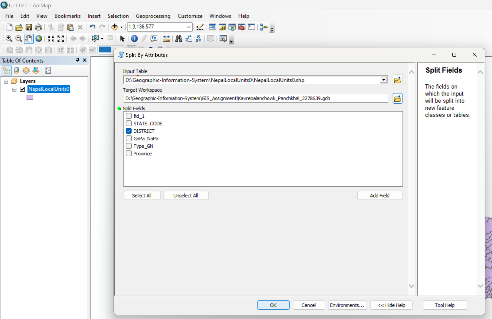
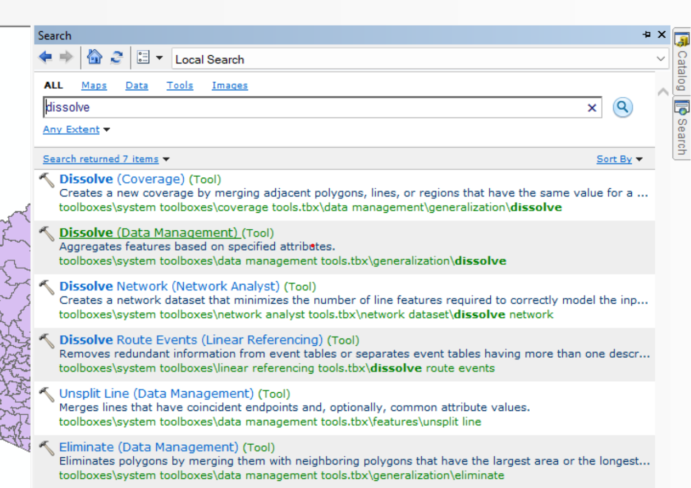
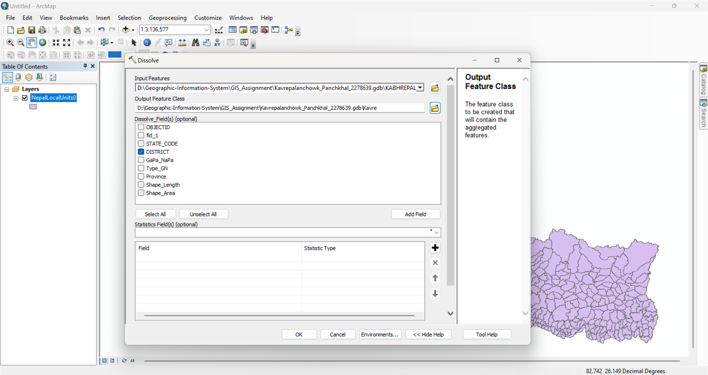
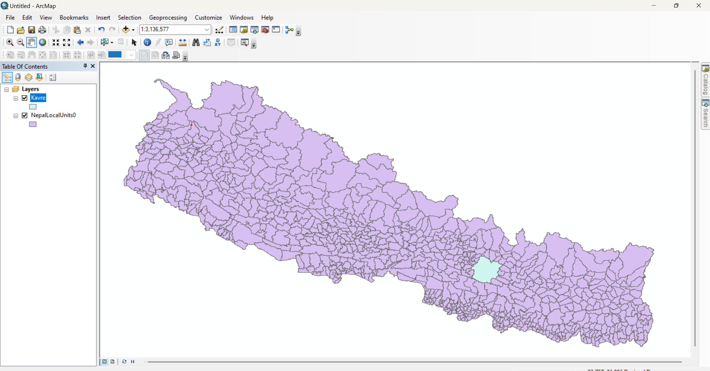

# Task 2: Administrative Boundary Data Processing

### Objective:
### The objective of this task is to extract administrative boundaries for the selected district and municipality and organize them properly for further GIS analysis.

---

### Step 1: Download Administrative Boundary Data

1. Open a web browser and visit:
    https://nationalgeoportal.gov.np
2. Download the Nepal Local Units Administrative Boundary (1:1,000,000) dataset.
3. Extract the downloaded files into the project workspace (outside the file geodatabase).

    
    
---

### Step 2: Add Administrative Data to ArcGIS

1. Open ArcMap or ArcGIS Pro.
2. Add the extracted administrative boundary shapefile to the map.

    

  after adding:

   
   
3. Verify that the attribute table contains district and municipality information.

     

---

### Step 3: Extract Municipality Data Using Split By Attribute

1. Go to search tool
2. Search Split tool.
3. Select Split By Attributes from Data Management Tools

    

4. Set the following parameters:

        Input Feature: Nepal Local Units administrative boundary layer
        Split Field: District name field
        Output Workspace:your_working_geodatabase.gdb

      

5. Run the tool to extract municipality boundaries for the selected district.

---

### Step 4: Create District Boundary Using Dissolve

1. Go to search tool
2. Search Dissolve.
3. Select Dissolve from Data Management Tools

      

4. Set the parameters as follows:

        Input Features: Municipality boundary layer of Kavrepalanchowk (from .gdb file)
        Dissolve Field: District name

     

5. Run the tool to generate a single district boundary.

    

---

### Step 5: Organize Outputs

All extracted municipality boundary layers and the dissolved district boundary are stored inside the Kavrepalanchowk feature dataset within the project geodatabase. This ensures proper data organization and spatial consistency for subsequent GIS analysis tasks.

---

## Conclusion

In this task, administrative boundary data were downloaded, processed, and organized for the selected study area. Municipality boundaries were extracted using the Split By Attribute tool, and a single district boundary was created using the Dissolve tool. All outputs were stored inside the Kavrepalanchowk feature dataset, ensuring a clean and well-structured geodatabase for further analysis.
