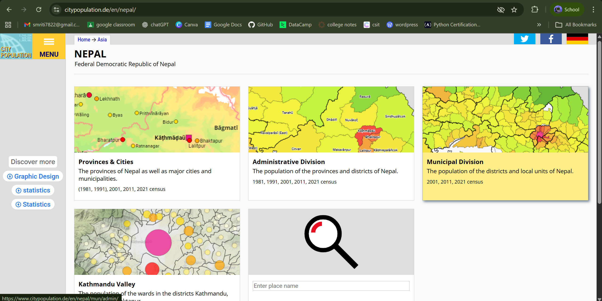
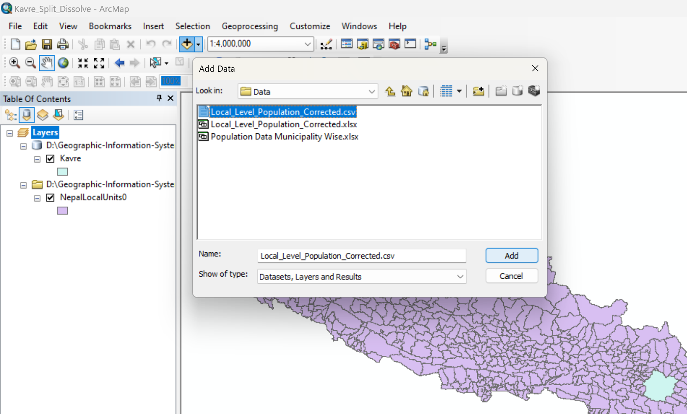
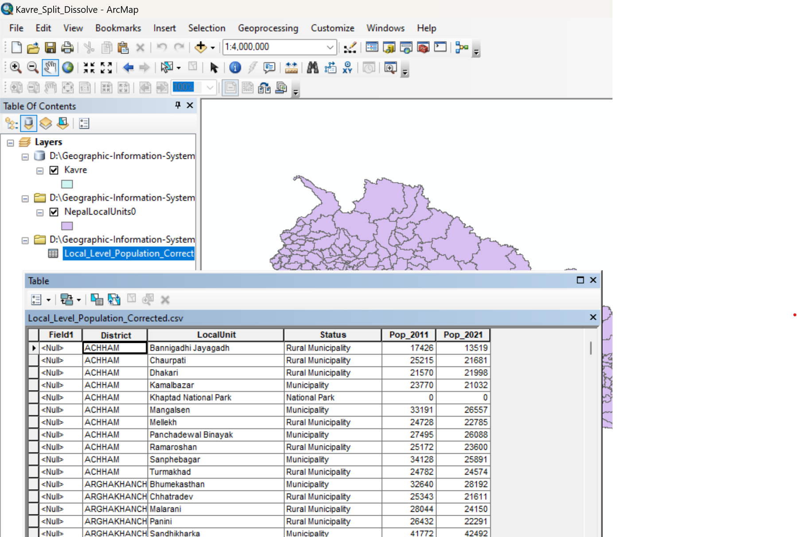
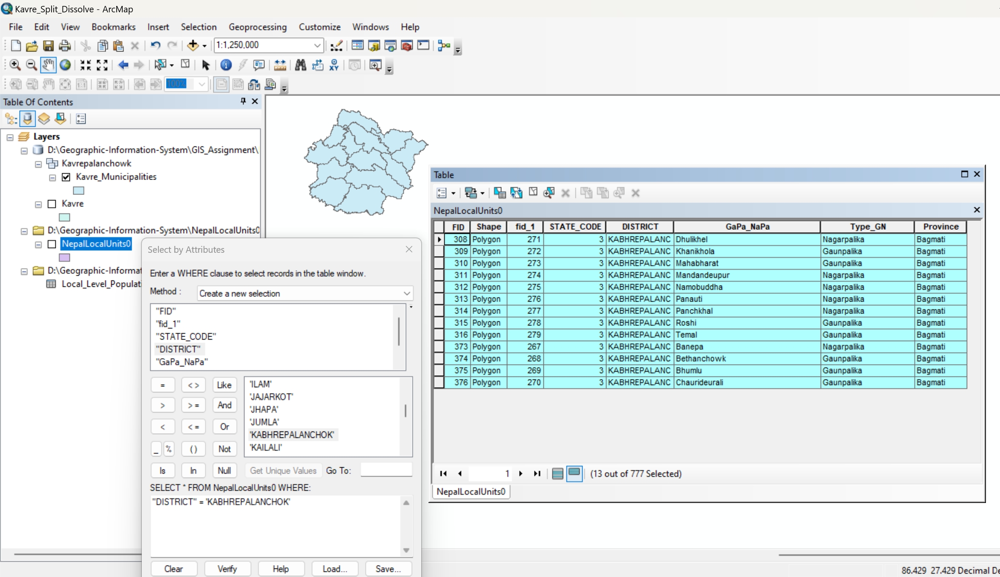
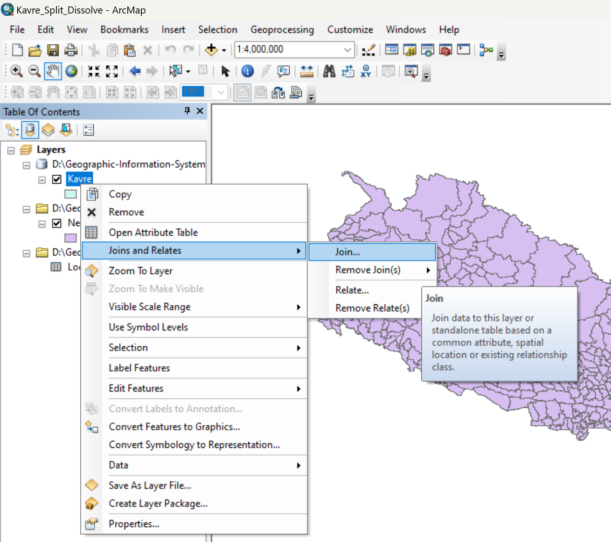
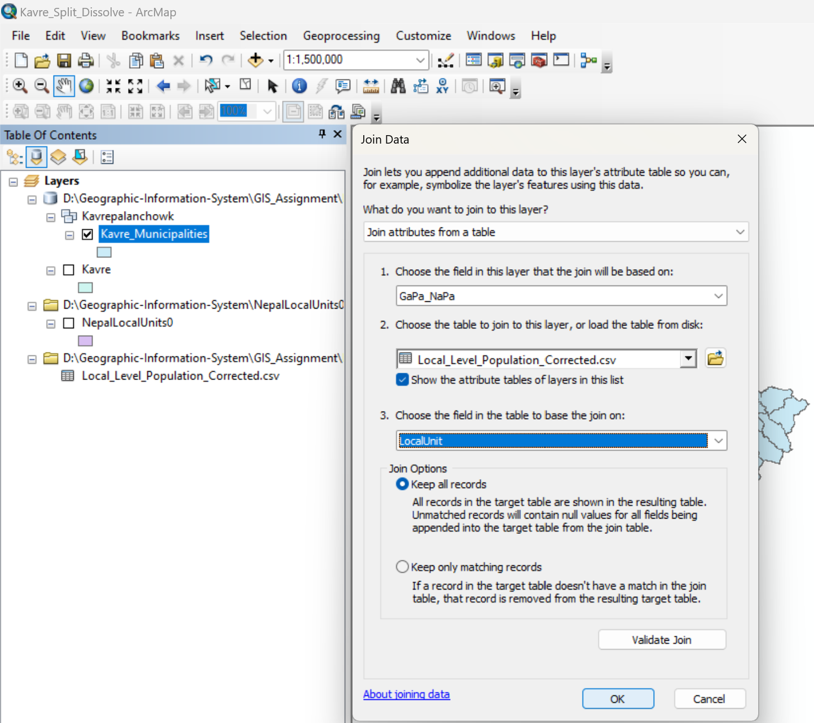
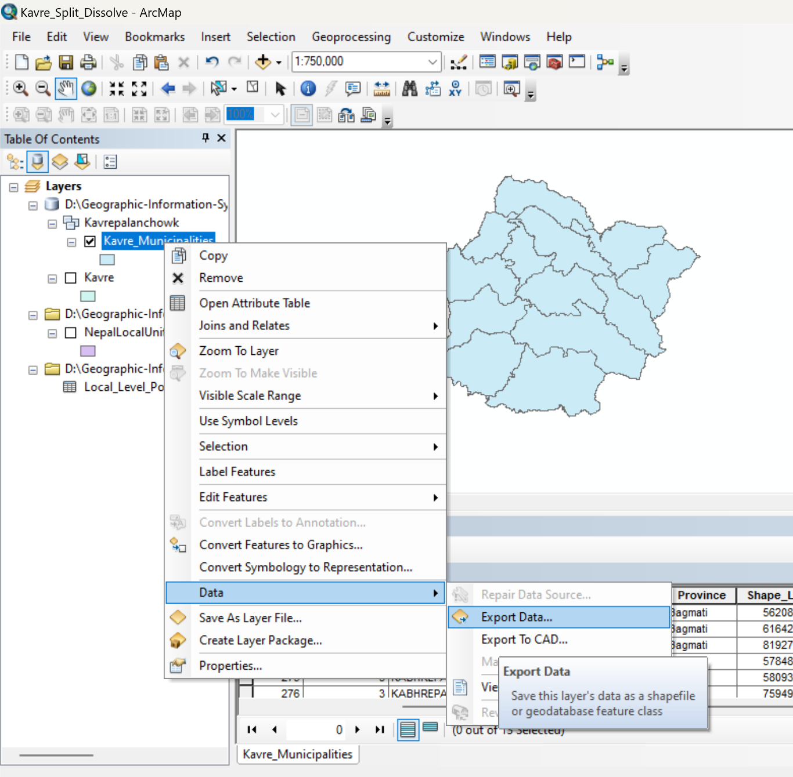
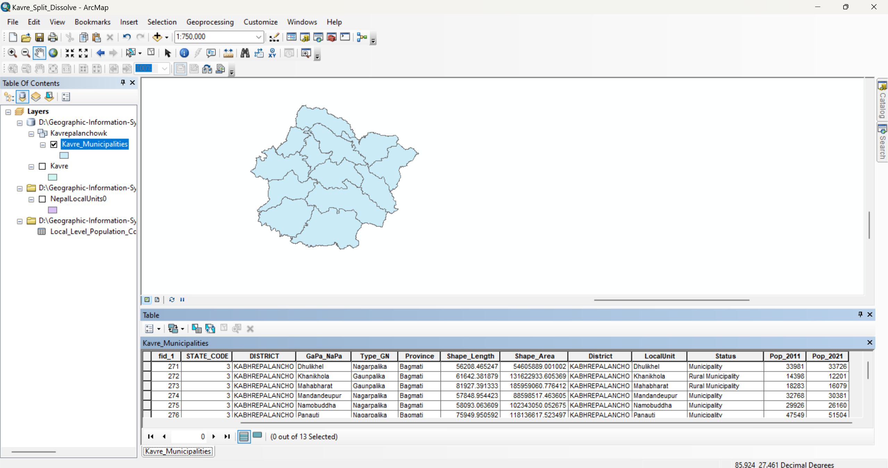

# Task 3: Population Data Collection and Integration

### Objective
### The objective of this task is to collect municipality-wise population data for the selected district, clean and standardize the dataset, and integrate it with the municipality boundary layer for further GIS analysis.

---

### Step 1: Download Population Data

1. Open a web browser and visit:
    https://www.citypopulation.de
2. Navigate to the population data section for Nepal.

    
   
3. Download municipality-wise population data for the selected district.
4. Save the dataset in the project workspace (outside the file geodatabase).

---

### Step 2: Clean and Prepare Population Data

1. Open the population dataset in Excel or a similar spreadsheet tool.
2. Ensure that municipality names exactly match those in the municipality boundary layer.
3. Remove unnecessary columns and keep only the following fields:

        District Name
        Municipality Name
        Municipality Status (Metro / Sub-metro / Municipality / Rural Municipality)
        Population 2011
        Population 2021

4. Check for spelling differences, extra spaces, or formatting issues and correct them.
5. Save the cleaned table in a compatible format (e.g., .xlsx or .csv).

---

### Step 3: Add Population Table to ArcGIS

1. Open ArcMap or ArcGIS Pro.
2. Add the cleaned population table to the map.

   

3. Verify that the attribute table loads correctly and that all required fields are present.

   

---

### Step 4: Export Municipality Boundary Layer for Joining

To ensure a stable and editable join, the municipality boundary layer was exported before performing the attribute join.

1. Right-click the municipality boundary layer.
2. Select Data → Export Features.
3. Save the exported feature class inside:

       Kavrepalanchowk_Panchkhal_2278639.gdb → Kavrepalanchowk feature dataset

Use this exported layer for the population data join.

---

### Step 5: Join Population Data with Municipality Boundaries

1. Right-click the exported municipality boundary layer.
2. Select Joins and Relates → Join.

    

3. Set the join parameters:

        Join Field (Layer): Municipality name
        Join Table: Cleaned population table
        Join Field (Table): Municipality name

   

4. Run the join and verify that population fields are correctly appended to the attribute table.

---

### Step 6: Verify Join and Save Outputs

1. Open the attribute table of the joined layer.
2. Confirm that population values for 2011 and 2021 are correctly linked to each municipality.
3. Export the data from Joined Layer.

   
   
4. Save the final joined layer inside the Kavrepalanchowk feature dataset for use in further GIS analysis and thematic mapping.

   

---

## Conclusion

In this task, municipality-wise population data were collected, cleaned, and prepared to ensure consistency with the spatial dataset. The population table was standardized and then successfully integrated with the municipality boundary layer through an attribute join. To maintain data integrity, the municipality layer was exported prior to joining and all resulting outputs were stored within the Kavrepalanchowk feature dataset. This process enabled the creation of a reliable spatial attribute dataset suitable for further GIS analysis and thematic mapping.
