# Task 4: Topographic Map Sheet Processing

## Objective
The objective of this task is to identify the correct topographic map sheet covering the selected municipality using the Nepal map sheet index, download the corresponding topographic map, and accurately georeference it in ArcGIS so that it aligns with existing vector datasets.

---

## Step 1: Load Nepal Map Sheet Index in ArcGIS

1. Open **ArcMap** (or ArcGIS Pro).
2. Click **Add Data** and load the **Nepal Topographic Map Sheet Index** layer (e.g., `nepal.md` or similar).

      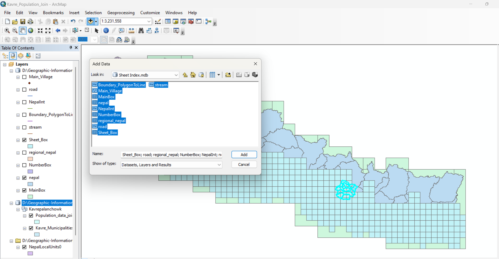
   
3. Add supporting vector layers:
   - Municipality boundary (Panchkhal)
   - District boundary (Kavrepalanchowk)
4. Zoom to the **Kavrepalanchowk District**.
5. Turn on the **Identify Tool**.
7. Click on the map sheet index polygon that covers your municipality.
8. Note down the **sheet box / sheet code** (e.g., B A B D C D B A B A C D).
9. Confirm that the identified sheet fully covers Panchkhal Municipality.

      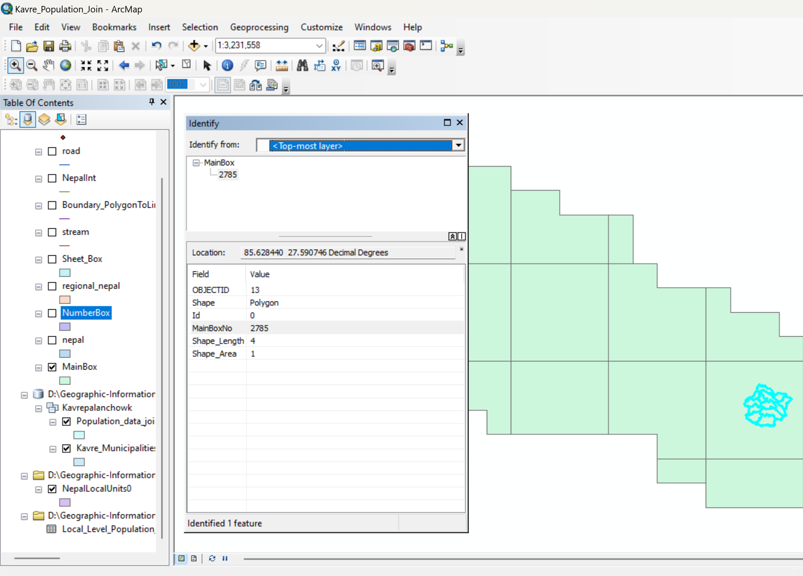

(for this i've taken dhulikel)

This step ensures the correct topographic map sheet is selected.

---

## Step 2: Download the Topographic Map Sheet

1. Open a web browser.
2. Visit:  
   https://pahar.in/nepal-topo-maps
3. Search for the map sheet using the identified **sheet name or code**.
4. Download the topographic map (usually in **JPEG, TIFF, or PDF** format).

   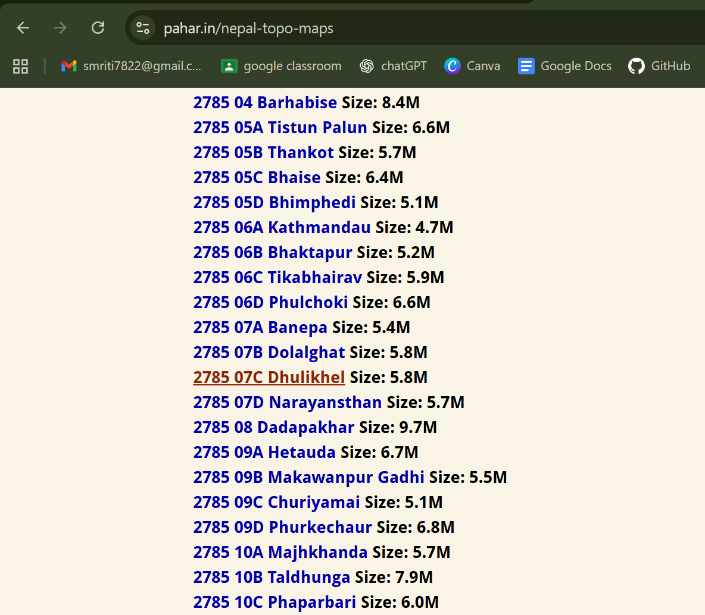

6. If the file is compressed, extract it.
7. Store the extracted image in your project folder **outside the file geodatabase (.gdb)**.

   

---

## Step 3: Add the Topographic Map to ArcGIS

1. In ArcMap, click **Add Data**.
2. Add the downloaded topographic map image.

      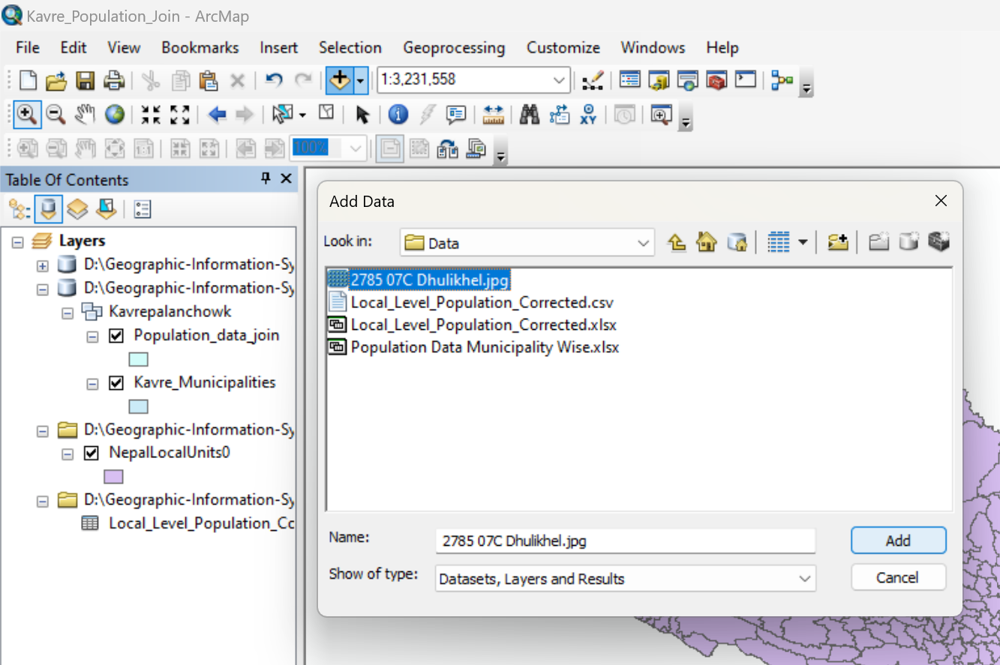

3. The map will then appear:
   - In an incorrect location, or
   - At the corner of the map, or
   - Not aligned with other layers  
4. This confirms that the raster is **not georeferenced** and needs georeferencing.

---

## Step 4: Check and Set the Data Frame Projection

1. Right-click on **Layers** (Data Frame) in the Table of Contents.
2. Click **Properties** → **Coordinate System** tab.
3. Set the coordinate system to the same system used by your vector data  
4. Click **OK**.
5. Ensure all vector layers align correctly with each other before georeferencing.

      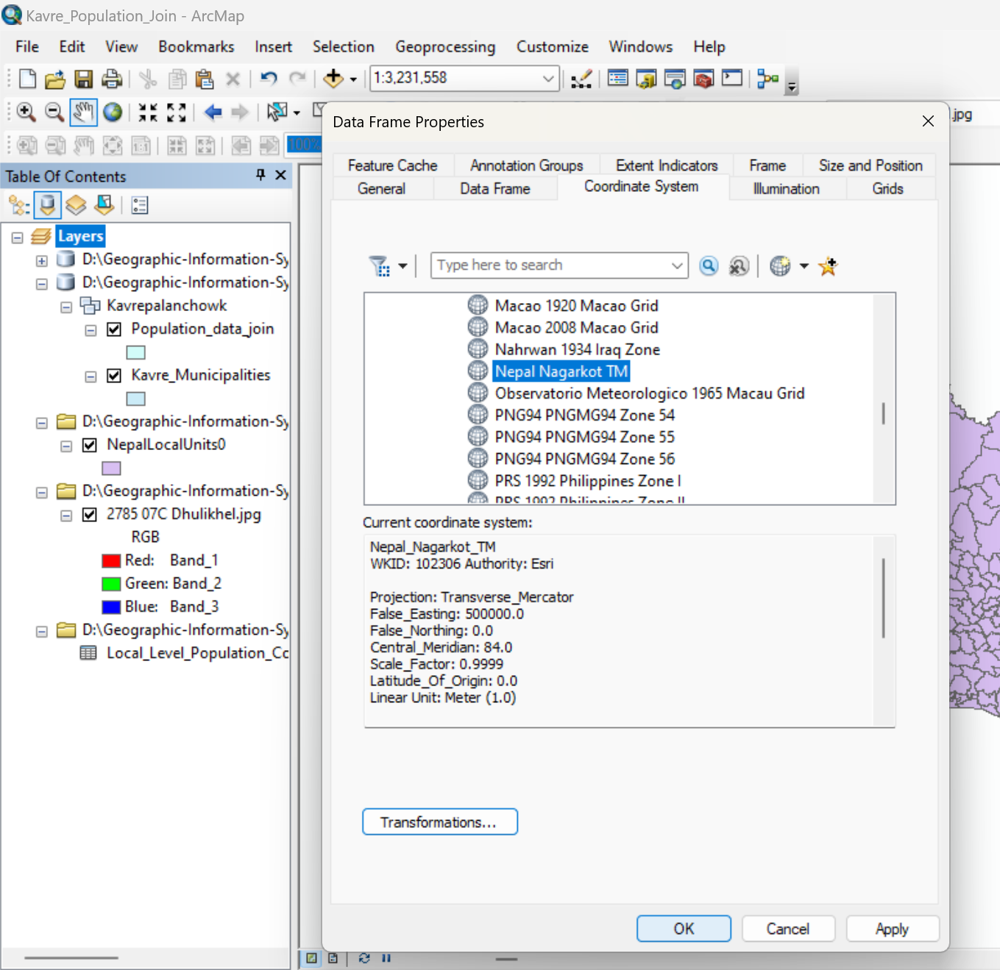

This step avoids flipping or misplacement issues during georeferencing.

---

## Step 5: Locate and Enable the Georeferencing Toolbar

1. Go to the top menu bar.
2. Click **Customize** → **Toolbars**.
3. Enable **Georeferencing**.
4. The Georeferencing toolbar will appear.
5. From the dropdown list in the toolbar, select the **topographic map raster layer**.

      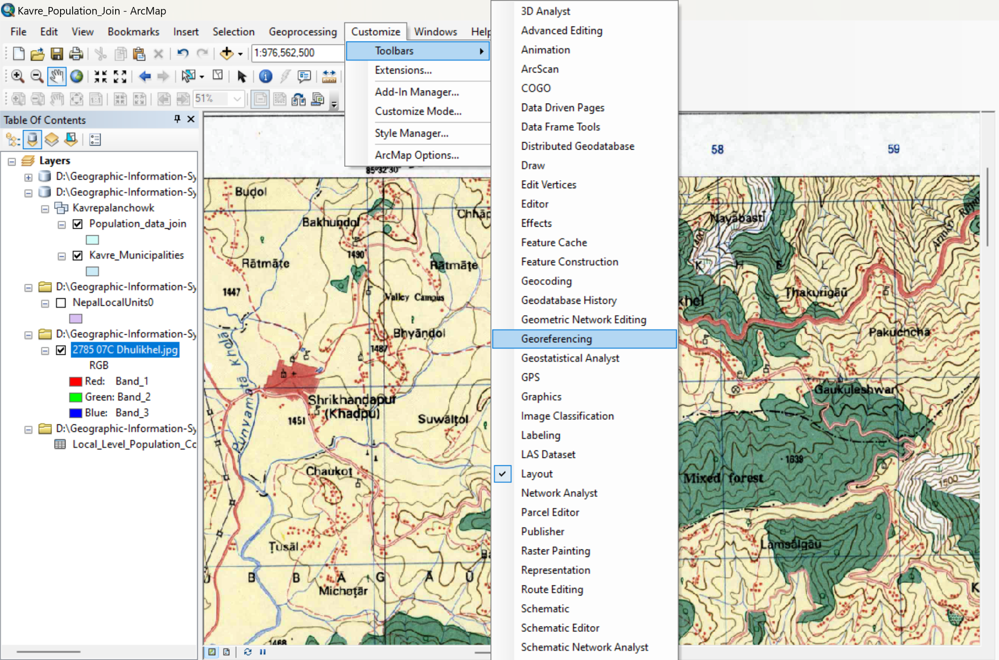

---

## Step 6: Prepare for Georeferencing

1. Zoom to the raster layer (Right-click raster → **Zoom to Layer**).
2. If the map appears upside down or flipped:
   - Use **Georeferencing → Rotate** or **Flip** options if needed.
3. Identify **known reference points** on the map:
   - Coordinate grid intersections
   - Corner grid values
   - Clearly identifiable road junctions or landmarks

      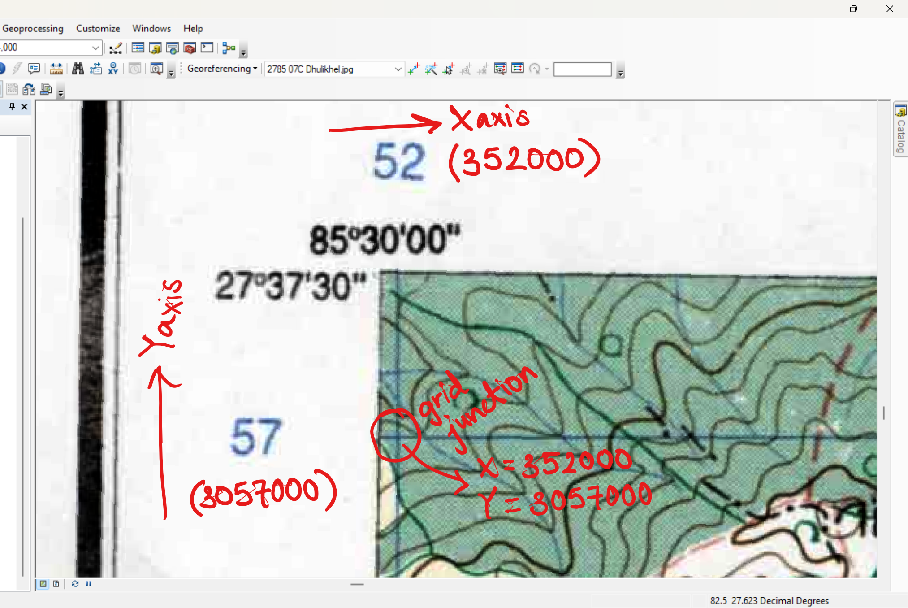

---

## Step 7: Add Control Points

1. Click **Add Control Points** in the Georeferencing toolbar.    
2. Click on a known point on the **topographic map image** (e.g., grid intersection).

      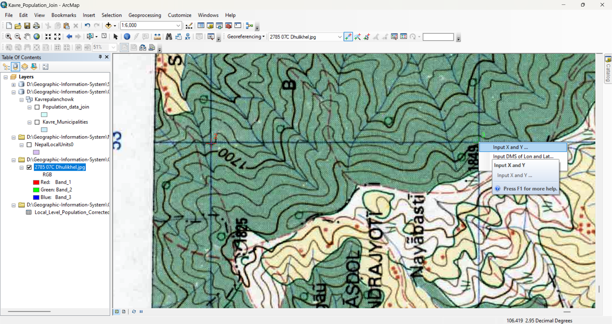  

3. Then:
   - Click the corresponding location on an existing vector layer, **or**
   - Right-click and manually enter the X and Y coordinates shown on the map margins.

     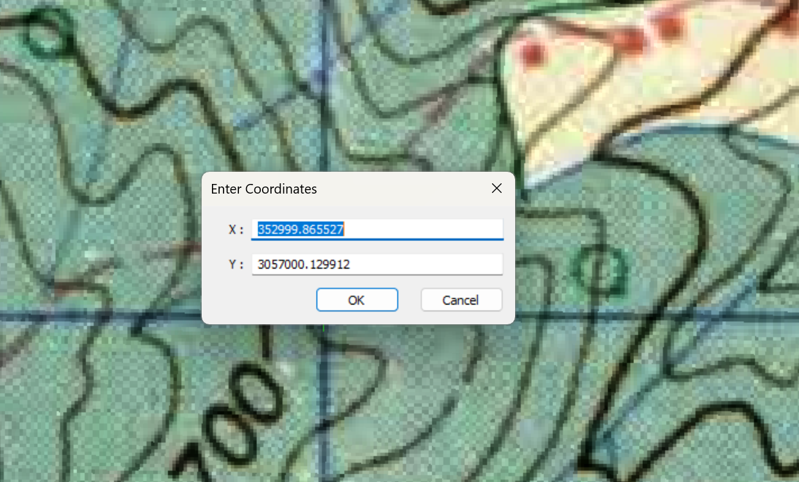

4. Repeat the process for multiple points:
   - Add at least **4–6 control points**
   - Distribute them evenly (corners and center of the map)
5. Avoid placing all control points close together.

---

## Step 8: Check Alignment and Adjust

1. After adding control points, the raster should begin aligning with vector layers.
3. If the image flips or shifts:
   - Delete incorrect control points
   - Re-add them carefully from linktable or repeat the process

       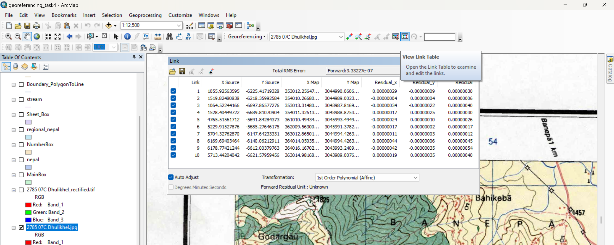
     
4. After georeferencing the map looks like this:

      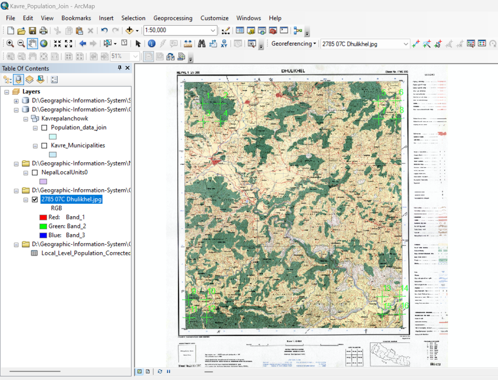

---

## Step 9: Set Transformation Method

1. In the Georeferencing toolbar, click **Georeferencing → Transformation**.
2. Select **First Order Polynomial (Affine)** for standard topo maps.
3. Check the **Link Table** to review residual errors if required.

      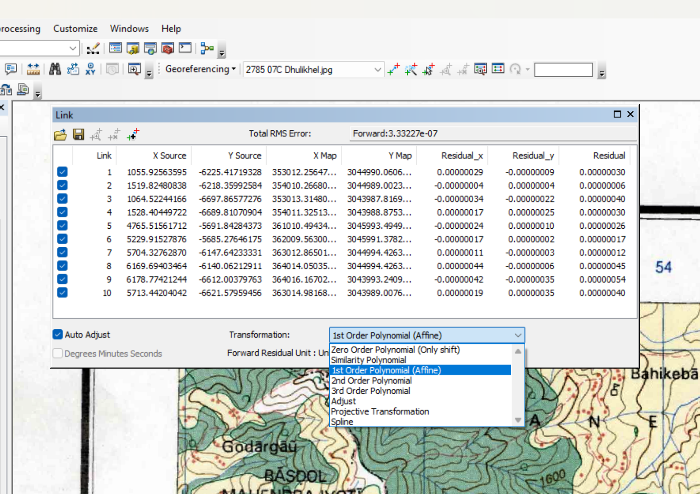

---

## Step 10: Save the Georeferenced Map

1. Once alignment is satisfactory:
   - Click **Georeferencing → Update Georeferencing**, or
   - Click **Rectify** to create a new georeferenced raster
2. Save the output in your project workspace or file geodatabase as instructed.

    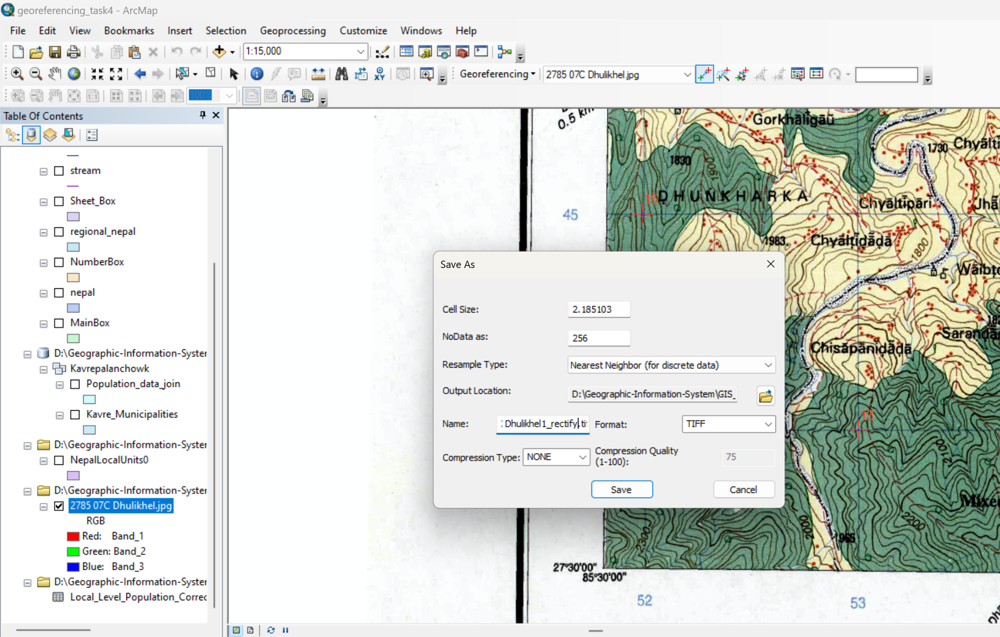

---

## Conclusion

In this task, the Nepal topographic map sheet index was used within ArcGIS to accurately identify the map sheet covering Dhulikhel Municipality in Kavrepalanchowk District. The corresponding topographic map was downloaded from an official source and added to ArcGIS. The map was then georeferenced by setting the correct projection, enabling the georeferencing tools, and applying well-distributed control points using coordinate grid references. The final georeferenced map was verified against existing vector layers, ensuring accurate spatial alignment for further analysis.
