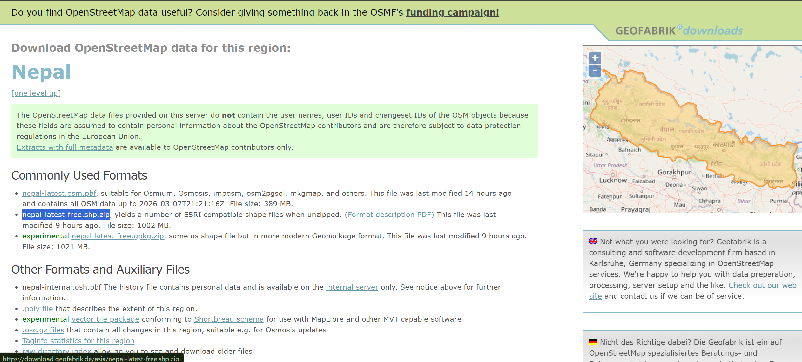
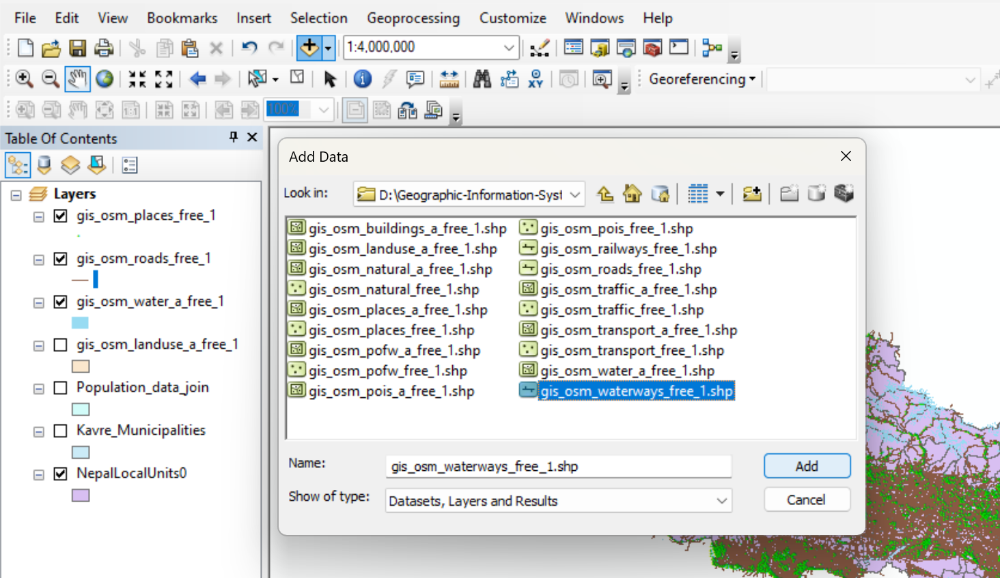
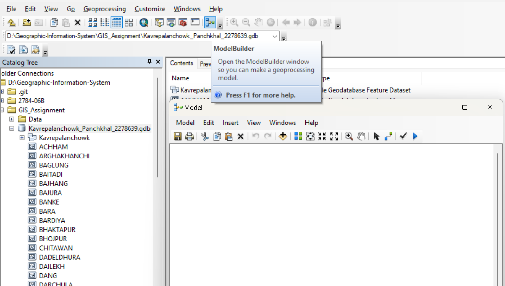
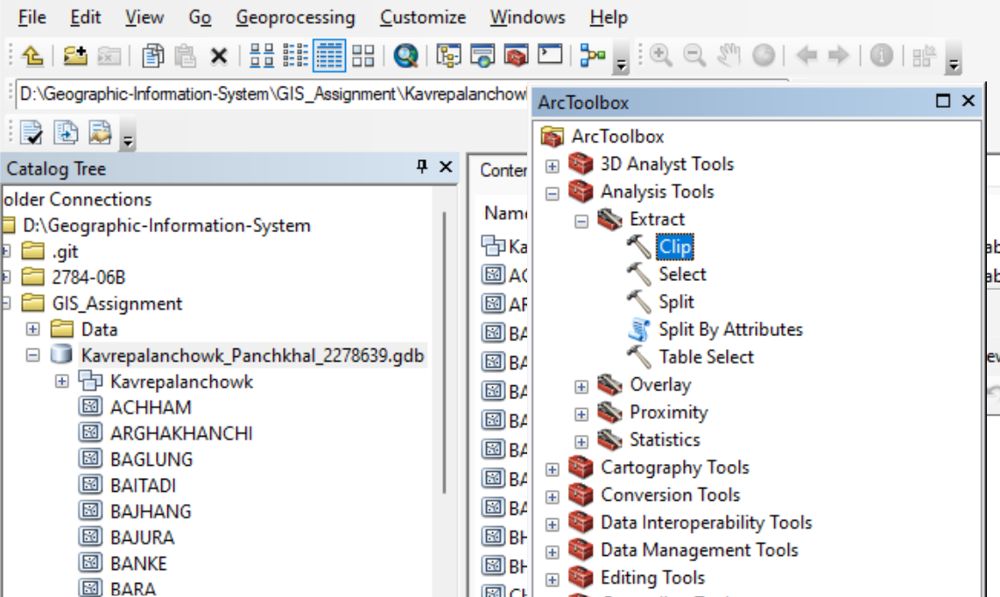
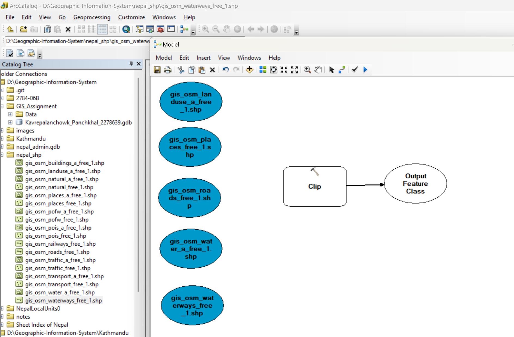
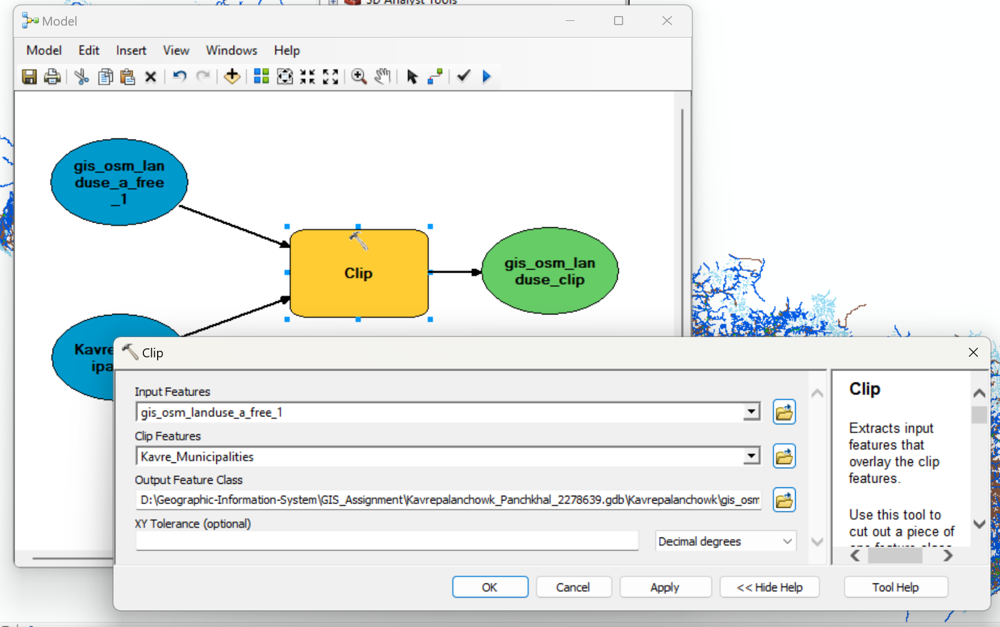
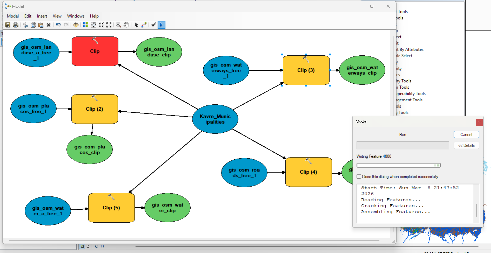
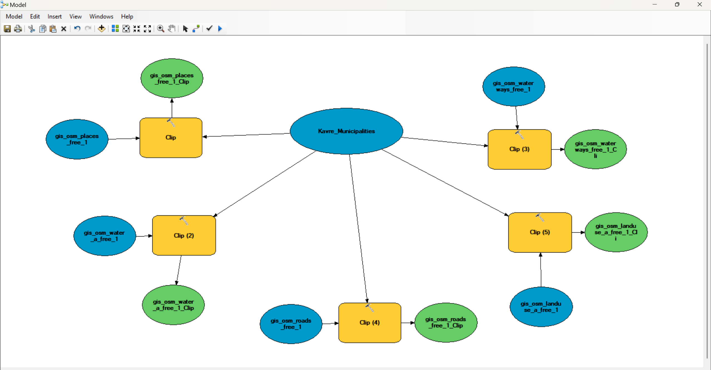

# Task 5: Thematic Layer Download and ModelBuilder Processing

## Objective
The objective of this task is to obtain thematic GIS layers of Nepal from the OpenStreetMap dataset provided by Geofabrik and process them using ArcGIS ModelBuilder. The layers are clipped using the district boundary so that only the data relevant to the selected district is retained. The processed outputs are then stored inside a dedicated feature dataset for organized spatial analysis.

---

## Step 1: Download Thematic GIS Layers

1. Open a web browser.
2. Visit the Geofabrik OpenStreetMap data download page:
    https://download.geofabrik.de/asia/nepal.html

3. Download the dataset:
   
    nepal-latest-free.shp.zip
   
4. Extract the downloaded ZIP file.
Inside the extracted folder, locate the following shapefiles:

        gis_osm_landuse_a_free_1.shp
        gis_osm_places_free_1.shp
        gis_osm_roads_free_1.shp
        gis_osm_water_a_free_1.shp
        gis_osm_waterways_free_1.shp

Store these shapefiles inside your project data folder.

  

These layers represent important thematic information such as land use, settlements, road networks, water bodies, and waterways.

---

## Step 2: Add the Thematic Layers to ArcGIS

1. Open ArcMap (or ArcGIS Pro).
2. Click Add Data.
3. Navigate to the extracted dataset folder.
4. Add the following layers to the map:

        Landuse
        Places
        Roads
        Water
        Waterways

    

5. Also add supporting layers:

        District boundary (Kavrepalanchowk)
       Municipality boundary (Dhulikhel or Panchkhal)

These layers will be used as inputs for the ModelBuilder processing.

---

## Step 3: Create a ModelBuilder Model

1. In ArcCatalog, go to tool section and click model builder.
The ModelBuilder window will open.

    

ModelBuilder allows automation of repetitive GIS operations such as clipping multiple layers.

---

## Step 4: Add Clip Tools to the Model

1. Open ArcToolbox.
2. Navigate to:

        Analysis Tools
         → Extract
           → Clip

   

3. Drag the Clip Tool into ModelBuilder.
4. Locate following shapefiles in arc catalog

        gis_osm_landuse_a_free_1
        gis_osm_places_free_1
        gis_osm_roads_free_1
        gis_osm_water_a_free_1
        gis_osm_waterways_free_1
        Also add the District Boundary layer.
5. Drag the shapefiles in model builder.

   

---

## Step 5: Connect Layers to the Clip Tool

1. For each thematic layer:
2.  Connect the input layer to the Clip tool.

3. Set the Clip Feature as the district boundary layer.

    Example:
   
            Input Feature → gis_osm_roads_free_1
            Clip Feature → District Boundary
            Output Feature Class → roads_clip

    

4. Repeat the process for all layers.

Each thematic layer will now be clipped using the district boundary.

---

## Step 6: Set Output Locations

1. For each Clip tool output:
2. Set the output location to the previously created feature dataset.

    Example outputs:

        kavrepalanchowk\landuse_clip
        kavrepalanchowk\places_clip
        kavrepalanchowk\roads_clip
        kavrepalanchowk\water_clip
        kavrepalanchowk\waterways_clip
   
This ensures that all processed layers are stored in an organized structure.

---

## Step 7: Run the Model

1. Click the Run button in ModelBuilder.

The model will automatically perform clipping for all thematic layers.

The output layers will appear in the map and inside the feature dataset.

   

This step completes the automated processing of thematic data.

---

## Step 8: Save the ModelBuilder Workflow

1. Click Save in ModelBuilder.
2. Name the model:

        Clip_District_Thematic_Layers

3. Store the model inside your toolbox.

    

---

## Conclusion

In this task, thematic GIS layers for Nepal were downloaded from the Geofabrik OpenStreetMap data repository. The relevant layers including land use, places, roads, water bodies, and waterways were added to ArcGIS for analysis. A feature dataset was created to store processed outputs. Using ModelBuilder, an automated workflow was developed to clip each thematic layer using the district boundary. The clipped layers were stored within the district feature dataset, ensuring organized spatial data management and enabling further geographic analysis for the selected study area.
