# Task 7: Map Preparation and Visualization

## Objective
The objective of this task is to prepare and visualize thematic maps using spatial and population data within ArcGIS. Municipality-wise population density for the year 2021 and population change between 2011 and 2021 are calculated and represented using appropriate classification and symbology in Map View. In addition, a comprehensive general-purpose district map is created in Layout View that integrates multiple thematic layers such as administrative boundaries, roads, land use, water bodies, waterways, and settlements. Proper cartographic elements including title, legend, scale bar, north arrow, grid, and data source are added to ensure that the maps are clear, informative, and suitable for geographic interpretation and presentation.

---

## Task 7.1: Municipality-wise Population Density Map (2021)

### Objective
The objective of this task is to calculate the population density of each municipality for the year 2021 and visualize the spatial distribution using appropriate classification and symbology in ArcGIS Map View. The map helps in understanding how population is distributed across municipalities and identifying areas of high and low population concentration.

---

### Step 1: Add Required Data

1. You need:

        Municipality boundary layer
        Population data (2021)

   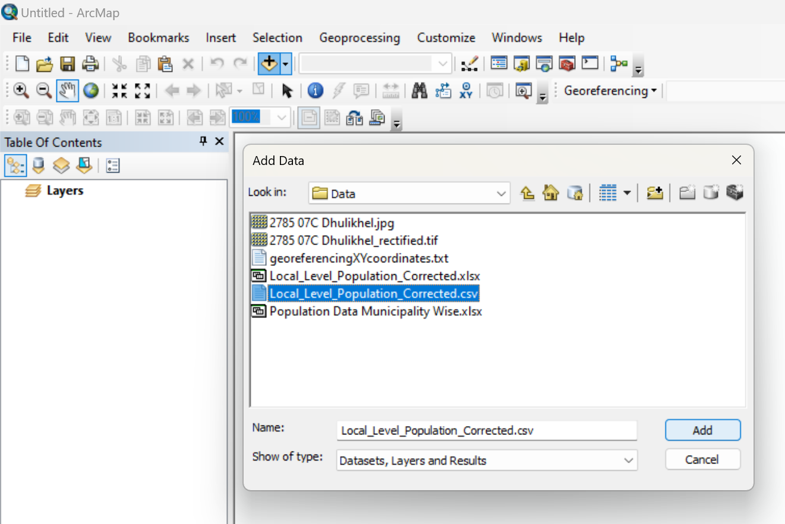

2. Join the population table to the municipality layer using the municipality ID/name.

   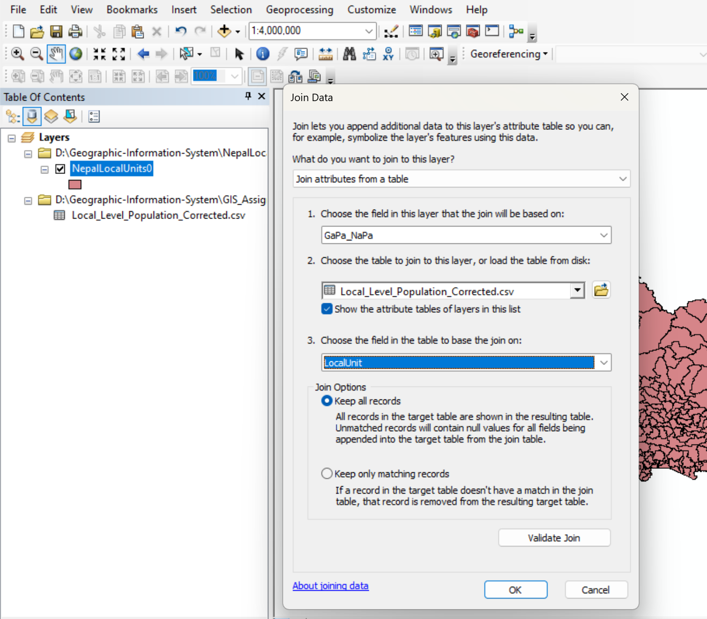

---

### Step 2: Calculate Population Density

Population density formula:

    Population Density= Population/Area
	​
1. Open Attribute Table of municipality layer
2. Add Field
   
       Field name: Pop_Density
       Type:Double
       Right-click field → Calculate Field

    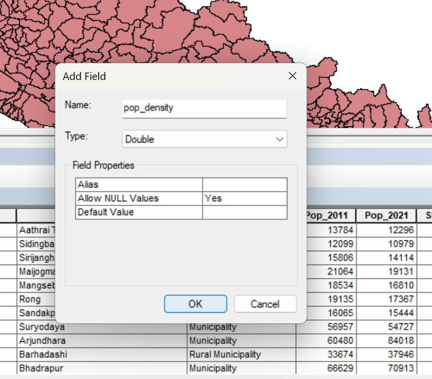

3. Right click field and Calculate Field

    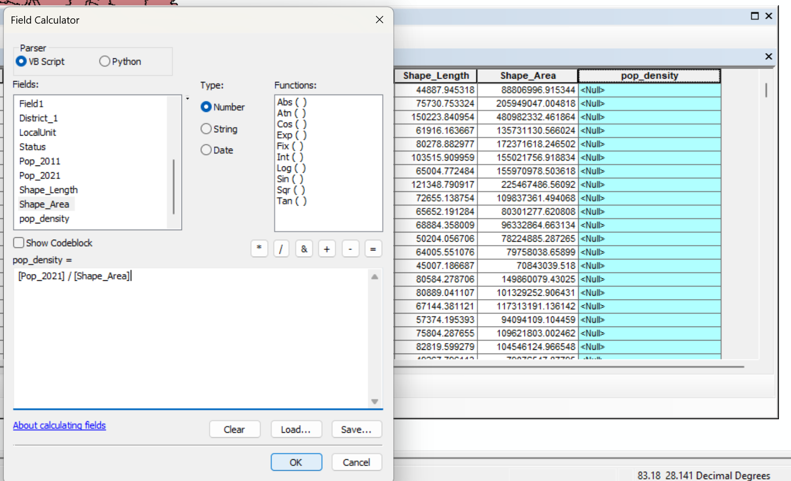

---

### Step 3: Apply Symbology

1. Right click municipality layer
2. Symbology
3. Select Graduated Colors
4. Field: Pop_Density
5. Classification method (recommended): Natural Breaks (Jenks)
6. Classes: 23
7. Color scheme: Light → Dark
   
    (dark = higher density)

   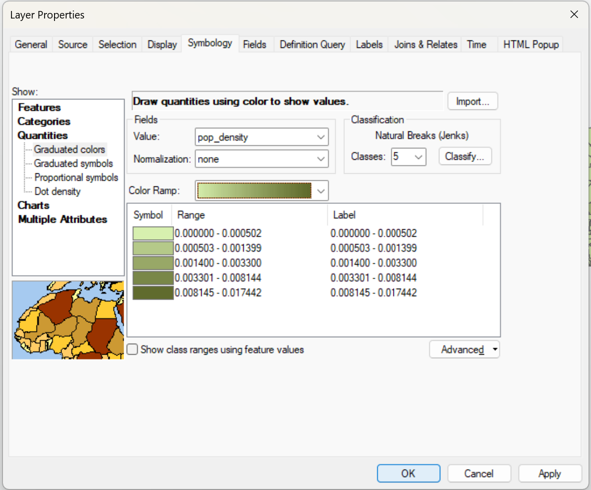
   

---

### Step 4: Label (optional)

Label by: Municipality Name

  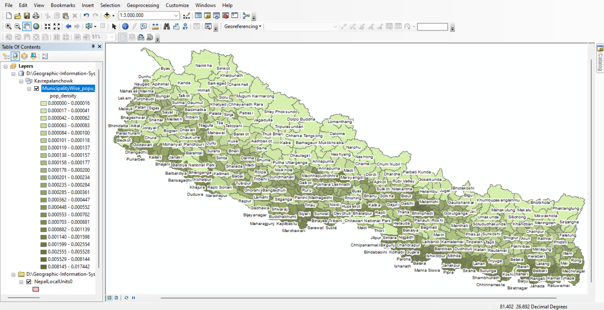

---

## Task 7.2: Municipality-wise Population Migration Map (2011–2021)

### Objective
The objective of this task is to analyze and visualize population change between the 2011 and 2021 census periods at the municipality level. Population change is calculated and represented using suitable symbology in Map View to clearly show areas of population increase and decrease.

---

### Step 1: Add Population Data

1. You need:

		Population 2011
		Population 2021

2. Join to municipality layer.

(see task 3 or 7.1 if confusion on how to add data and join)

---

### Step 2: Calculate Population Change

1. Add field: Pop_Change
2. Type: Long Integer
3. Calculate field:

		Pop_2021 - Pop_2011

	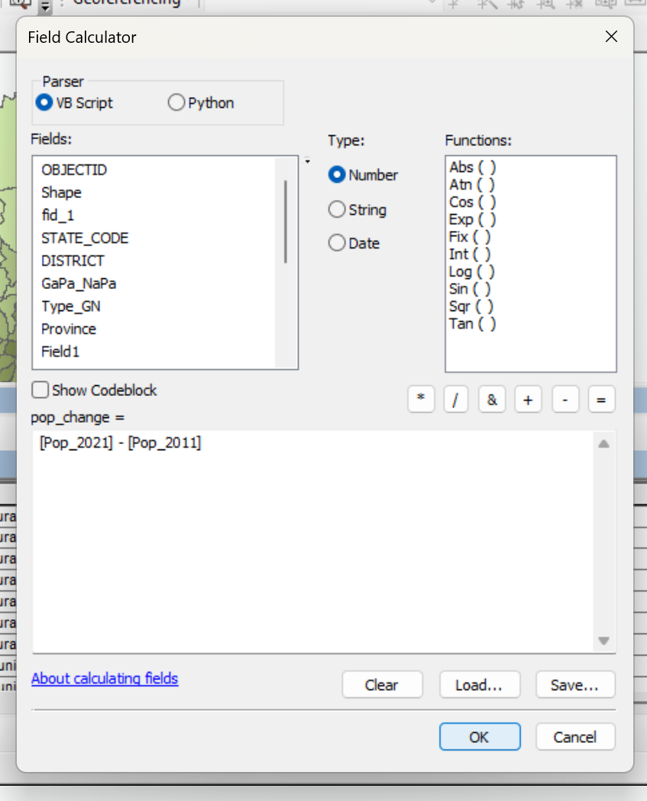

---

### Step 3: Apply Symbology

1. Use Graduated Colors or Diverging Colors.
2. Best method: Graduated Colors
3. Field: Pop_Change
4. Classification: Natural Breaks or Equal Interval

	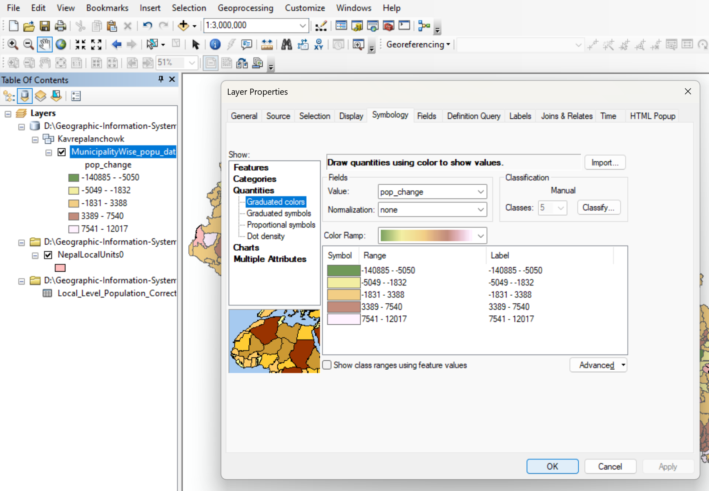

---

### Step 4: Population Change in Map View

   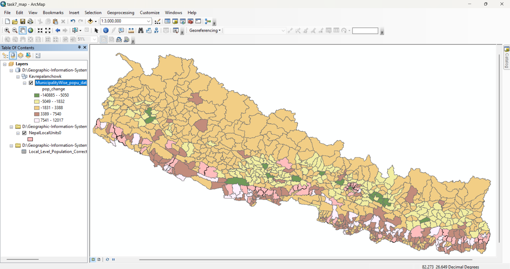

This clearly shows migration trends.

---

## Task 7.3: General Purpose District Map

### Objective
The objective of this task is to design a complete general-purpose map of the selected district using Layout View in ArcGIS. Multiple thematic layers including administrative boundaries, roads, land use, water bodies, waterways, and places are integrated with appropriate symbology and labeling. Essential cartographic elements such as title, legend, scale bar, north arrow, grid, and data source are included to produce a clear and well-structured map suitable for presentation and spatial interpretation.

---

### Step 1: Add data

1. Navigate to the feature dataset created for the district and add the thematic clipped layers to the map.

		 gis_osm_landuse_clip
		 gis_osm_places_clip
		 gis_osm_roads_clip
		 gis_osm_water_clip
		 gis_osm_waterways_clip
   
	  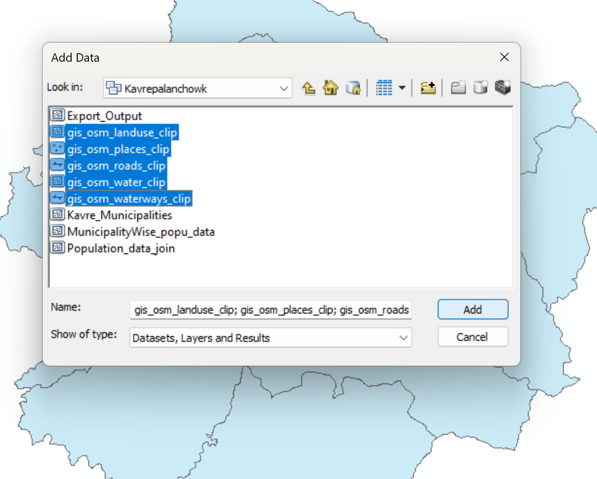

3. Add the district boundary and municipality boundary layers.

---

### Step 2: Apply Symbology to Layers

1. landuse_clip -> Light green
2. places_clip -> Black or Grey
3. roads_clip -> Red or Orange
4. water_clip -> Light blue
5. waterways_clip -> Blue

To change symbology:
1. Right click the layer.
2. Select Properties.
3. Go to Symbology.
4. Choose an appropriate symbol and color.

	  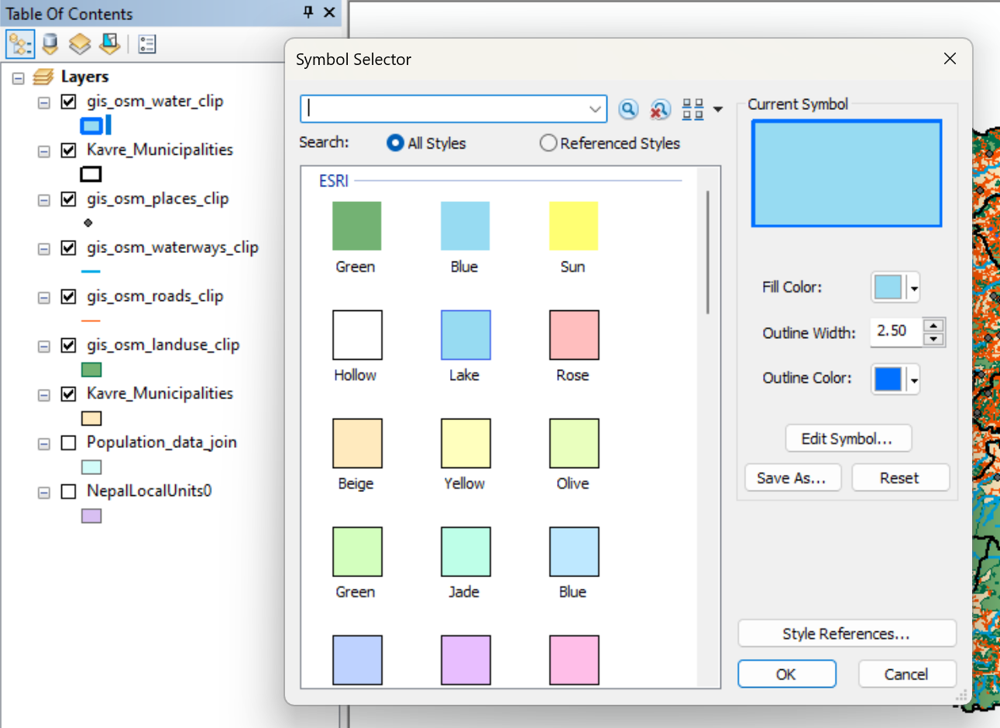

---

### Step 3: Label Important Features

1. Right-click the places layer.
2. Select Label Features.
3. Use the name field for labeling.
   
Similarly, important features such as municipalities or rivers can also be labeled if necessary.

   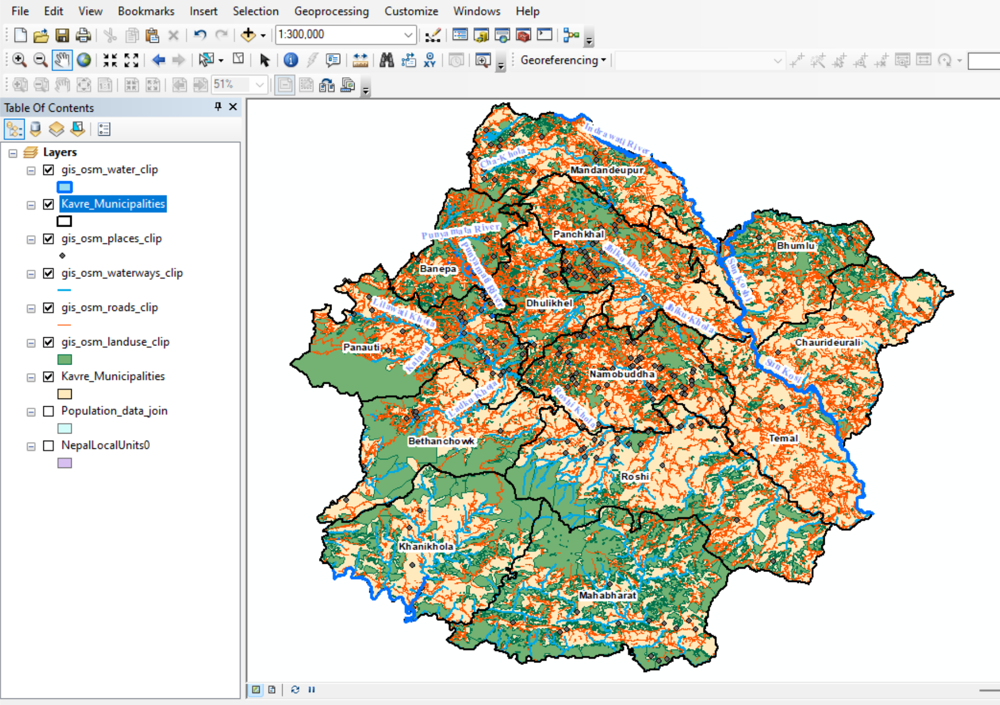

---

### Step 4: Switch to Layout View

1. Click on Layout View.
   
	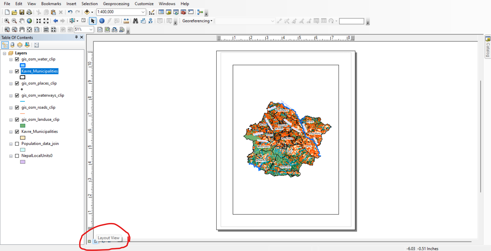
	
Layout View allows the map to be arranged properly for presentation and printing.

---

### Step 5: Add Essential Map Elements

1. Insert the required cartographic elements into the map layout.

	a. Title

			Insert(on menu bar) → Title

	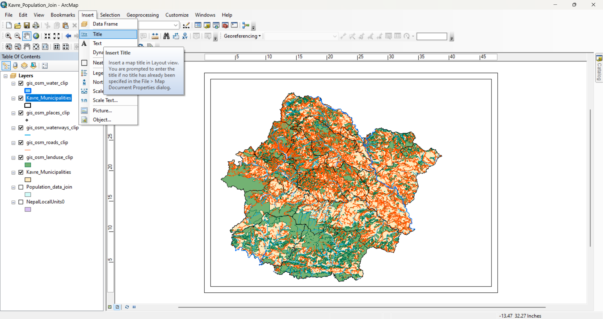

	b. Legend

			Insert → Legend

	c. Scale Bar

		Insert → Scale Bar

	d. North Arrow

		Insert → North Arrow

	e. Data Source

		Insert a text box and write:
		Source: OpenStreetMap (Geofabrik), CBS Nepal

	f. Grid

		View → Data Frame Properties → Grids → (choose)Add Grid

	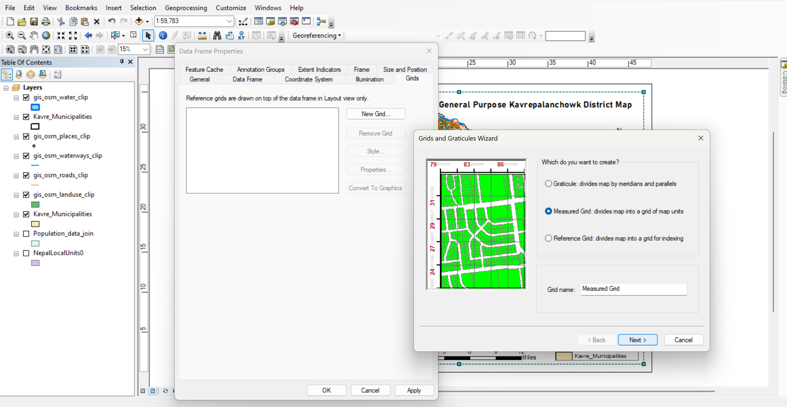

---

### Step 6: Arrange the Map Layout

1. Adjust the placement of the legend, title, north arrow, and scale bar so that the map appears clear and balanced.
2. Ensure all map elements are visible and readable.

   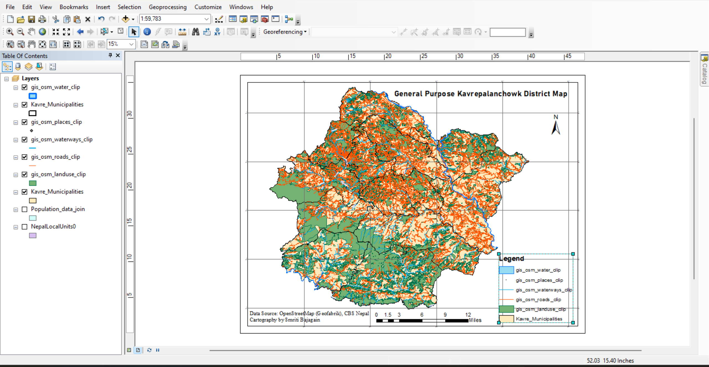

---

### Step 7: Export the Final Map

1. Click File → Export Map.

	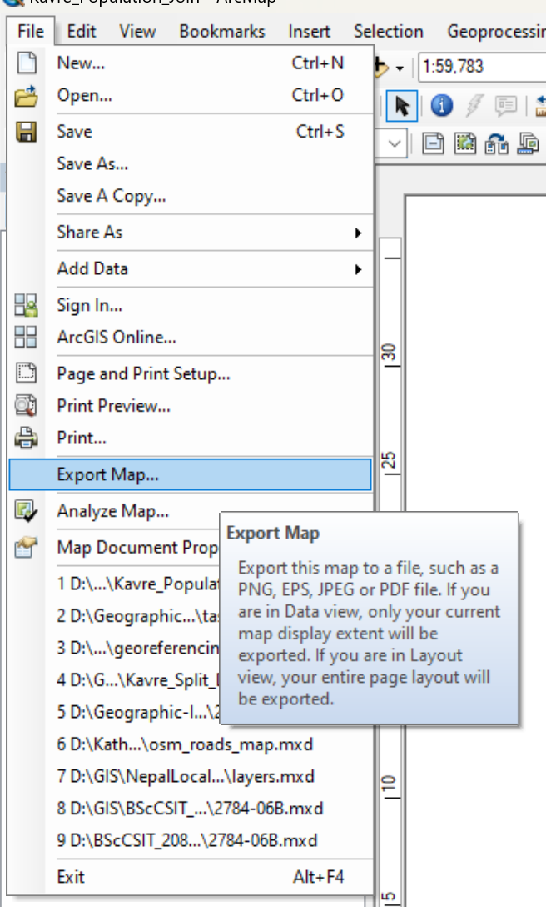
   
3. Choose JPEG or PNG format.
4. Save the final map for submission.
	
---

### The final Cartographic Map

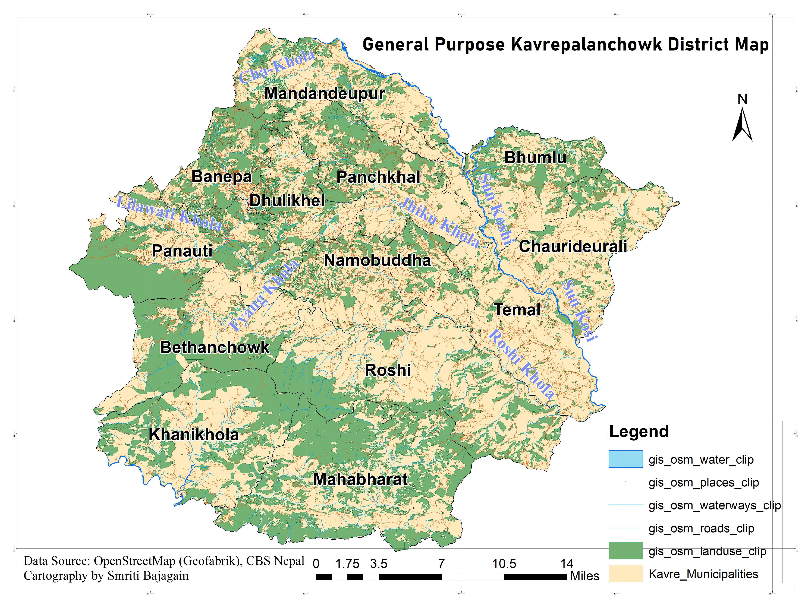

---

## Conclusion

In this task, a general-purpose map of the selected district was created using ArcGIS Layout View. Various thematic layers including administrative boundaries, roads, land use, water bodies, waterways, and places were integrated with appropriate symbology and labeling. Essential map elements such as title, legend, scale bar, north arrow, grid, and data source were added to produce a clear and informative map suitable for geographic visualization and presentation.
